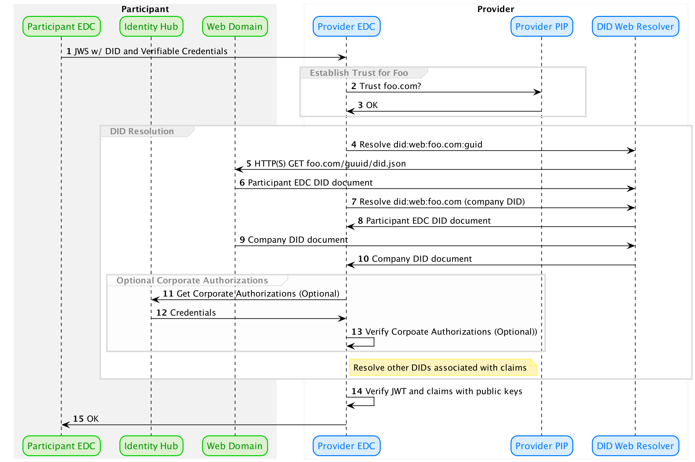

# A DID Web Approach for EDC Distributed Identity 

This document formalizes an approach to a decentralized identity infrastructure for the [EDC](https://github.com/eclipse-dataspaceconnector/DataSpaceConnector) that
is not dependent on distributed ledger technologies (DLT) such as a blockchain. 

Two authentication and authorization flows are defined: (1) All DID Web, which uses did:web and DNS as a trust mechanism and does not use a DLT; and (2) Hybrid ION, 
which uses did:web for ephemeral DIDs and ION to anchor a "root" DID for each participant in a dataspace.

**NB: Diagrams are created using [PlantUML](https://plantuml.com/). Rendering plugins are available for IntelliJ and VS Code.**
          
## Flow 1: All DID Web

The following sequence diagram outlines the All DID Web flow:



[Sequence Source](did.web.resolution.puml) 

### Key Attributes

The key attributes of the All DID Web flow are:
- DIDs are resolved using the did:web method and therefore are not anchored using a DLT.
- There are two classes of DIDs
  - **EDC Participant DID**: EDCs are dynamic, 0..n, they come and go, and each EDC replicaset has a DID. This is necessary since EDC replicasets may have different claims
    (e.g. an EDC deployment in the U.S. vs Europe)
  - **Corporate DID**: Static, always 1, rarely changes 
- The did:web method defines a mapping from the DID URN to a URL for resolving the DID document. This makes it possible to resolve a DID using a simple URL mapping algorithm
- The corporate did can be resolvable based on a well-known URL or resolved using did:web.
- Trust can be keyed off a combination of Verifiable Credentials and the DNS domain where a DID is resolved. 

     
### DID Document Structure

The corporate and EDC DIDs have a slightly different structure.

#### Corporate DID Document & Credentials
- Contains a service endpoint pointing to a _Self-Description_
- Contains a service endpoint pointing to an _Identity Hub_
- The _Identity Hub_ contains 0..N verifiable credentials pertaining to the company

#### EDC Participant DID Document
- May contain a service endpoint pointing to a _Self-Description_                                              
- May contain a service endpoint pointing to an _Identity Hub_ **if** Flow 2 (described below) is supported.

### Questions & Issues
1. Do we need to use [DID domain linking](https://identity.foundation/.well-known/resources/did-configuration/)? Isn't linkage established by resolving the DID from the domain 
using did:web? One of the issues is the domain config document references all DIDs. This could become cumbersome when there are many EDC participant DIDs:

```
{
  "@context": "...",
  "linked_dids": [
    "jwt..."
  ]
}
```

It may also be a benefit if the EDC DIDs are GUIDs so that they are not practically crawlable.    

2. We may need to support two authorization flows 
  - **Sub Flow 1**: All claims are included in the JWS presented to the provider by the participant. This may run into HTTP header size limitations if there are a large number of
    claims presented in the JWS. 
  - **Sub Flow 2**: Claims may be included in the JWS but the provider may query the participant's Identity Hub for additional claims.

3. Support for tokens. We may need to support a token mechanism where the provider provides a token to the client when it is first authorized to avoid reinitializing the flow on 
   subsequent requests for performance.

4. Is it possible to host a corporate DID on a subdomain instead of the root domain? This would add more flexibility.

## Flow 2: Hybrid ION

The following sequence diagram outlines the Hybrid ION flow. The main difference is the corporate DID is anchored on ION and a backing blockchain (or other DLT): 


[Sequence Source](did.resolution.hybrid.ion.puml) 
